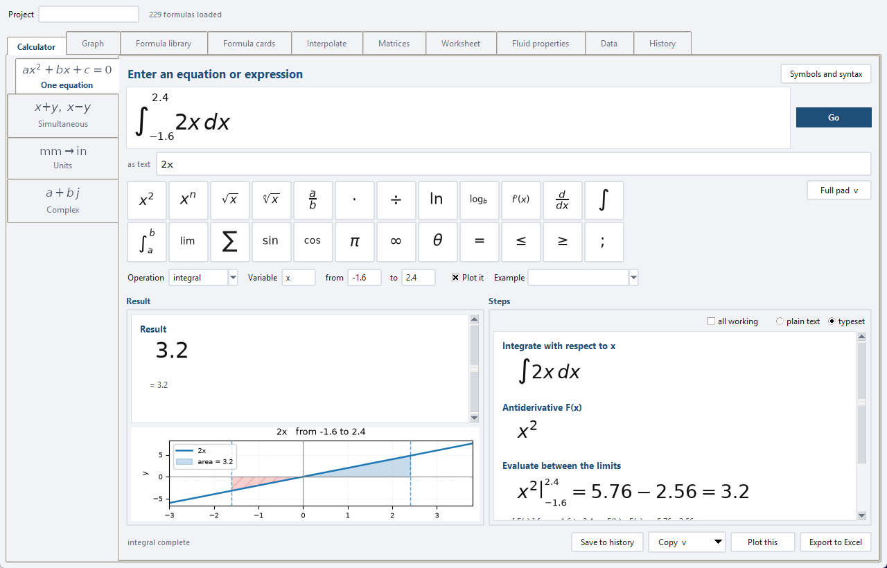
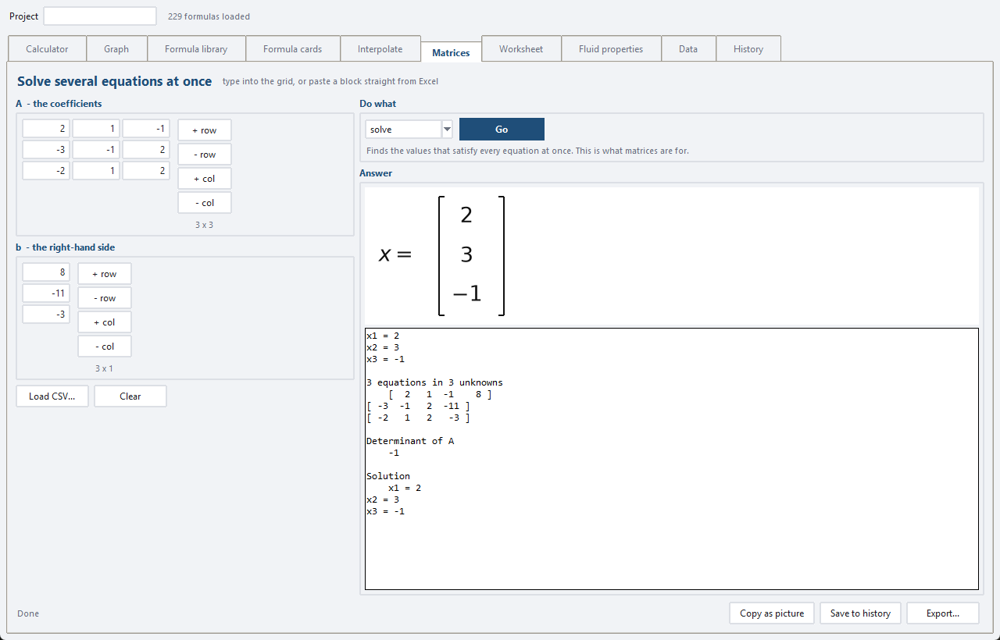
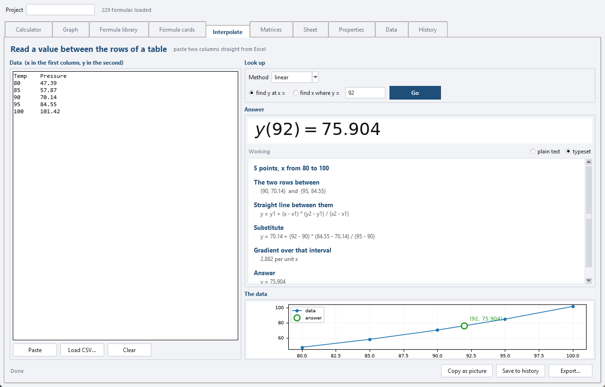
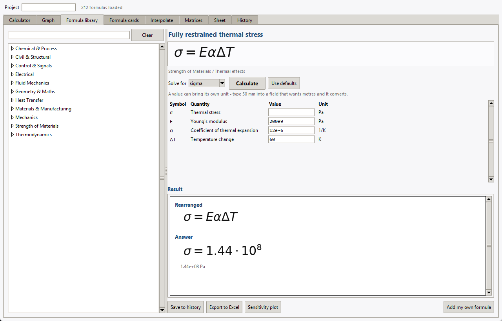
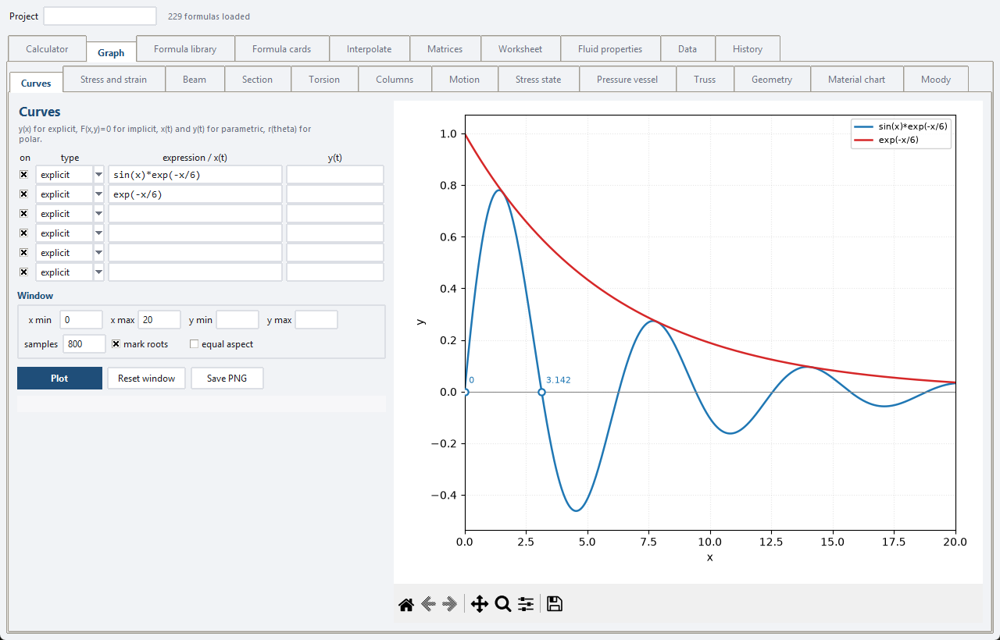

# EngiCalc

A desktop equation solver, grapher and engineering formula library. Symbolab's
solving and graphing, minus the AI and the subscription, plus the two things it
doesn't do: a searchable library of engineering formulas that rearrange for any
variable, and export to a **live, formula-driven** Excel workbook.

Everything runs locally. No account, no internet connection, nothing uploaded.

New to this codebase? Read **HANDOVER.md** first - it covers what is built, what
was verified and how, what was not, and what to do next. **CLAUDE.md** covers how
to work on the code.

**[Download the installer](https://github.com/sheetdeveloper/engicalc/releases/latest)**
for Windows - no Python needed.

---



*A definite integral, typed into the equation bar as a real integral sign, with
the area it measures shaded underneath and the working beside it.*

| | |
|---|---|
|  |  |
| **Matrices** - several equations solved at once | **Interpolation** - reading between the rows of a table |
|  |  |
| **212 formulas**, each rearranging for any variable | **Graphing** - explicit, implicit, parametric and polar |

---

## Running it

**Windows** - double-click `run_engicalc.bat`.

The first run creates a private Python environment in `.venv` and installs the
four dependencies (two or three minutes). Every run after that opens straight
away. If Python isn't installed the script tells you where to get it.

    run_engicalc.bat              start the app
    run_engicalc.bat test         run the self-tests
    run_engicalc.bat reinstall    rebuild the environment from scratch

To get a desktop icon: right-click `run_engicalc.bat` → Send to → Desktop
(create shortcut). Right-click the shortcut → Properties → Change Icon if you
want to give it one.

**macOS / Linux** - `./run_engicalc.sh` (same three commands).

Requires Python 3.10 or newer with Tkinter, which the standard python.org
installer includes on Windows and macOS. On Debian/Ubuntu: `sudo apt install
python3-tk`.

---

## The tabs

### Calculator

Type an equation and press Go. Everything on screen is typeset properly -
including the equation bar itself. Press the definite integral button and you
get a real integral sign with empty boxes at the limits; Tab moves between them
and you type the values straight in. Fractions, powers, roots, logs and limits
all behave the same way, and they nest, so the denominator of a fraction can
hold a square root. Answers and working appear as fractions, radicals,
integrals and Greek letters rather than ASCII.

Underneath sits a plain-text box for anyone who would rather type
`2x^2 - 5x - 3 = 0` and be done with it. The two are kept in step - edit either
one and the other follows, and typed text becomes real structure, so typing
`sqrt(x)` there gives you a radical upstairs with an editable box under it.
There is also a plain-text toggle on the steps panel if you want something
copyable, and a Copy LaTeX button for pasting into a report.

**Plot it** draws the answer beside it. For a definite integral that means the
integrand with the area shaded between the limits - which is what the answer
actually measures - with area below the axis hatched in red, since it counts as
negative in the total. For a solve, the curve with its roots marked. The
checkbox turns it off, and anything with no sensible picture (a system of
equations, say) simply doesn't show one.

Under the entry boxes sits the **symbol pad**: the common symbols on one row,
with **Full pad** expanding the rest grouped by kind. Every button is drawn in
real notation and tells you what it types when you hover. The ones with a shape
to them - fractions, powers, roots, logs, and the calculus buttons - draw that
shape in the equation bar with the caret already in the first box.

**Help -> Symbols and syntax reference** opens a searchable table of every
symbol: what it looks like, what to type to get it, and a worked example.
Double-click a row to type it straight into the calculator. Handles linear, quadratic, polynomial, rational,
radical, exponential, logarithmic, absolute-value and trigonometric equations,
and falls back to numerical root-finding when no closed form exists.

The **Steps** panel shows the working: terms moved to one side, denominators
cleared (with the domain restriction noted), the equation classified, the
discriminant, the factorisation or quadratic formula, then each answer
substituted back in to verify it.

Operations: solve, roots, simplify, expand, factor, evaluate, derivative,
integral (indefinite or definite), limit, series, and simultaneous systems
(separate the equations with `;`).

Inequalities work too - `x^2 <= 9`, `1/x < 1`, `abs(x - 3) <= 5`, `x != 0` -
and answer with the range that satisfies them (`x in [-3, 3]`) rather than a
list of points, showing the boundary points and the interval test as working.

### Graph

Up to six curves at once, in four flavours:

| Type | What you type | Example |
|---|---|---|
| explicit | y as a function of x | `x^2 - 4` or `y = sin(x)` |
| implicit | any relation in x and y | `x^2 + y^2 = 9` |
| parametric | x(t) and y(t) in the two boxes | `cos(t)` and `sin(t)` |
| polar | r as a function of theta | `1 + cos(theta)` |

Roots are marked and labelled. Full matplotlib pan/zoom toolbar underneath, and
Save PNG (or PDF/SVG) for reports.

### Formula cards

The whole library as typeset cards - name, formula in proper notation, branch.
Filter by branch, search by anything, click a card to open it ready to solve.
Recognising a formula by its notation is much faster than reading ASCII.

### Formula library

**212 formulas across 11 branches**: Mechanics, Strength of Materials,
Thermodynamics, Fluid Mechanics, Heat Transfer, Electrical, Civil & Structural,
Materials & Manufacturing, Chemical & Process, Control & Signals, and
Geometry & Maths.

Every formula carries its variables, units, descriptions, typical values and
assumptions. Pick what to solve for, fill in what you know, press Calculate.
The formula is rearranged symbolically first, then evaluated - so you see the
rearrangement and the answer, both typeset.

Formulas are drawn in the order they are conventionally written: F = ma, not
F = am. SymPy reorders terms as it evaluates, so anything shown to the user is
parsed without evaluation and printed with the ordering left alone.

800 of the 804 possible rearrangements (every variable of every formula) resolve
symbolically; the four that can't - fin efficiency, Heron for the semi-perimeter,
annuity interest rate - are solved numerically instead, and say so.

**Sensitivity plot** sweeps one input across a range and plots the result.

**Add my own formula** stores your own equations in
`~/.engicalc/user_formulas.json`, and they behave exactly like the built-in ones.

### Interpolate

Reading a value between the rows of a table - a steam table, a pump curve, a
materials chart. Paste two columns straight out of Excel, say which x you
want, and it gives you the answer with the working: which two rows it used,
the straight-line formula, the numbers substituted in, and the gradient over
that interval. That working is the part that gets marked.

Also does the reverse (given y, find x), a least-squares polynomial fit when
a straight line will not do, and nearest-row lookup.

**Extrapolation is called out.** Ask for a value beyond the ends of the data
and you still get an answer, with a warning saying it is a guess from outside
where the numbers came from. Reading past the end of a steam table silently
is how people get hurt.

### Sheet

Real work is never one calculation. It is a diameter, then an area from that
diameter, then a velocity, then a Reynolds number - and if the diameter
changes, everything after it should follow.

A sheet is a list of named steps worked down the page. Each step can use any
name defined above it, and nothing may use a name defined below it. Change
the bore from 50 mm to 100 mm, press Calculate, and every line beneath moves.
Sheets save and reopen as files.

A step that fails is reported and the ones after it carry on, because one
broken line in the middle should not blank the page.

### Matrices

Built around **A x = b** - solving several equations at once, which is what
matrices are for in engineering. A frame with a dozen joints gives a dozen
equations that all have to hold, and this solves them in one step. Type or
paste the coefficients one row per line.

Also determinant, inverse, transpose, rank, eigenvalues (natural frequencies,
buckling loads, principal stresses) and multiplication. Entries can be
symbols, not just numbers.

Two things it refuses to do quietly:

- **A singular matrix has no unique solution**, so it says so instead of
  returning whatever dividing by nearly-zero produced. The equations are
  either contradictory or say the same thing twice.
- **An ill-conditioned matrix is flagged.** If small changes in the inputs
  would swing the answer wildly, the figures are arithmetic rather than
  engineering, and you are told.

### History

Every calculation you save goes into a SQLite database at
`~/.engicalc/history.db`. Assign a project, add notes, star the important ones,
search across everything, reopen any entry back into the tab it came from, or
export a selection.

Turn on Options → Auto-save every result if you'd rather it kept everything.

---

## Excel export

This is the part worth knowing about. The exported workbook is **not** a
snapshot of numbers - each input gets its own labelled cell and a defined name,
and the result cell holds a real Excel formula:

    Q = m*c*(T2 - T1)      becomes      =v_c*v_m*(-v_T1+v_T2)

Change an input, Excel recalculates. Blue shaded cells are inputs, black cells
are formulas, and every sheet carries a legend saying so.

A SymPy-to-Excel printer handles `SQRT`, `LN`/`LOG`, all the trig and hyperbolic
functions, `ATAN2` (whose argument order Excel reverses), `FLOOR`/`CEILING` with
their step argument, `Piecewise` as nested `IF`, and rational powers. It sticks
to Excel-2007-era functions, so the workbooks open and recalculate correctly in
LibreOffice and Google Sheets too - verified by recalculating the generated
files in LibreOffice and checking for formula errors.

Three exports:

- **From the library** - one calculation, plus an optional Sensitivity sheet
  with a live formula per row and a line chart.
- **From the calculator** - any expression, with a cell per free symbol.
- **From History** - a log sheet of everything shown, *plus a rebuilt live sheet
  per saved formula calculation*. Exporting your past work gives you a workbook
  you can keep using.

---

## Input syntax

    Powers            x^2   or   x**2   (or press the pad button)
    Multiplication    2x, 3sin(x) and 2*x all work
    Roots             sqrt(x), cbrt(x), root(x, 3), x^(1/3)
    Logs              log(x) is natural; log(x, 10), log10(x), log2(x)
    Exponential       exp(x), e^x
    Absolute value    abs(x) or |x|
    Trig              sin cos tan asin acos atan atan2, plus hyperbolics
    Constants         pi, e, oo (infinity), I (imaginary unit)
    Greek             type rho, mu, sigma... or paste ρ, μ, σ
    Equations         one '=' per line
    Systems           separate with ';'   ->   x + y = 10; x - y = 2
    Numbers           2/3 stays exact, 0.667 is decimal, 1.5e-3 works

---

## Layout

    engicalc/
      core/
        parsing.py         text -> SymPy, whitelisted names only
        engine.py          solve / calculus / systems, returns CalcResult
        steps.py           the worked solution
        display.py         SymPy -> readable notation
        excel_printer.py   SymPy -> Excel formula strings
      formulas/
        model.py           Formula and Variable
        library.py         load, search, rearrange, user formulas
        data/              one module per branch - this is where to add formulas
      plotting/plot.py     all four curve types, root marking, sweeps
      core/interpolate.py  reading between the rows of a table
      core/matrices.py     A x = b, determinant, eigenvalues and the rest
      core/sheet.py        chained steps, each using the ones above
      core/units.py        mm and m cannot be quietly mixed
      storage/history.py   SQLite history
      export/excel.py      the workbook builders
      ui/
        app.py             window shell and cross-tab plumbing
        mathrender.py      LaTeX -> PNG -> Tk, with a plain-text fallback
        pad.py             the symbol list: buttons, help and syntax in one place
        mathfield.py       the editable typeset equation bar
        clipboard.py       put a picture on the clipboard, for Word
        matrixview.py      draws a matrix, which mathtext cannot
        symbol_pad.py      the pad widget
        reference_window.py  searchable symbol and syntax reference
        calculator_tab.py  graph_tab.py  library_tab.py  cards_tab.py
        history_tab.py     widgets.py
    tests/test_engicalc.py 150 tests
    main.py                entry point
    run_engicalc.bat       Windows launcher

### Adding formulas in bulk

Open the relevant file in `engicalc/formulas/data/` and add an entry:

```python
f("bolt_preload", "Bolt preload from torque", "Fasteners",
  "T = K*F*d",
  {"T": ("Tightening torque", "N*m"),
   "K": ("Nut factor", "-", "0.2"),
   "F": ("Preload", "N"),
   "d": ("Nominal diameter", "m")},
  notes="K is 0.2 for plain steel, ~0.15 lubricated.",
  assumptions="Elastic tightening, no thread damage.")
```

The third element of a variable tuple is an optional typical value used by
"Use defaults". Two rules the test suite enforces: the symbols in the equation
must exactly match the declared variables, and the formula must rearrange for
each of them. Run `run_engicalc.bat test` after adding any.

---

## Building a standalone .exe

For handing the app to someone who has no Python and should not have to
install any.

    build_exe.bat              build dist\EngiCalc.exe
    build_exe.bat clean        throw away the build folders first
    build_exe.bat debug        build a console version instead
    build_installer.bat        wrap it in Output\EngiCalc_Setup.exe

`build_exe.bat` makes its own environment in `.venv-build` (separate from the
`.venv` the app runs from, so installing PyInstaller cannot disturb a working
install), runs the test suite, and refuses to build if it fails. The result is
a single ~56 MB file that runs on a machine with nothing installed. The
installer needs [Inno Setup](https://jrsoftware.org/isdl.php), which is free;
the script looks in the usual places for it.

The version comes from `engicalc/__init__.py` and is stamped into
`installer.iss` automatically - don't edit it in two places.

**If a frozen build misbehaves**, use `build_exe.bat debug` and run
`dist\EngiCalc-debug.exe` from a command prompt. A windowed build that fails at
startup does so silently: the process sits there with no window and no error.
The console build prints the traceback. This is not hypothetical - the first
build of this app failed exactly that way, because the formula library imports
its eleven branch modules by name and PyInstaller's import scan could not see
them.

---

## Tests

150 tests covering the parser (including that it refuses `__import__`), the
engine, the formula library (every formula parses, declares its variables, and
rearranges), the history store, the Excel export, plotting, the typeset
rendering layer (every library formula, every pad symbol and every calculator
step is checked to render), the equation field (every shape renders, every box is
locatable, every one compiles back to input the parser accepts, and typed text
round-trips through the structure unchanged), and the answer plots.

The Excel printer tests are the interesting ones: they generate random values,
evaluate the printed Excel string in Python, and compare against SymPy to eight
decimal places - so the translation is proven faithful rather than
eyeballed.

---

## How the notation is drawn

Matplotlib's mathtext engine renders a LaTeX subset to a PNG and Tk loads the
PNG - so there is no TeX installation to manage and no extra dependency. Every
one of the 212 library formulas, and every calculator result and step, was
checked to render; anything mathtext cannot draw (matrices, piecewise braces)
falls back to monospace text rather than showing an error.

## Known limits

- Roots of periodic functions are reported as SymPy's principal solutions
  (`sin(x) = 0` gives 0 and pi, not the whole family).
- Units are labels for the user, not enforced - the app will happily let you mix
  mm and m. Keep one system per calculation.
- Complex results and infinities can't be written to Excel; the export says so
  rather than writing something wrong.
- Library formulas are the standard textbook forms. Check the assumption line
  before using any of them for design work - and none of the civil or structural
  entries include code factors.
